# 

  
  
  

---

<!-- START_SECTION:CYBER_PROFILE -->

  <!-- Side-by-Side Cards: Terminal ASCII Portrait & Neofetch Info Card -->
  <table border="0" cellpadding="0" cellspacing="0" style="border-collapse: collapse; border: none; margin: 0 auto;">
    <tr>
      <td align="center" valign="top" style="border: none; padding: 6px;">
        
      </td>
      <td align="center" valign="top" style="border: none; padding: 6px;">
        
      </td>
    </tr>
  </table>

  <!-- Centered Animated Contribution Graph -->
  

    
  

<!-- END_SECTION:CYBER_PROFILE -->

---

### 
🛠️ Tech Arsenal &amp; Capabilities

  

 

  ⚡ Built with pure SMIL animations, SVGs &amp; Python automation • Designed for peak performance.

